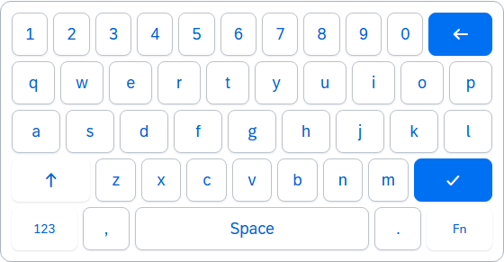
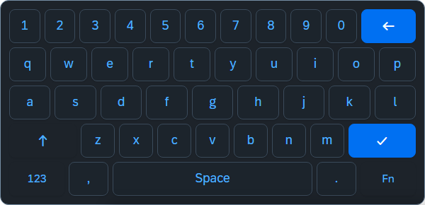
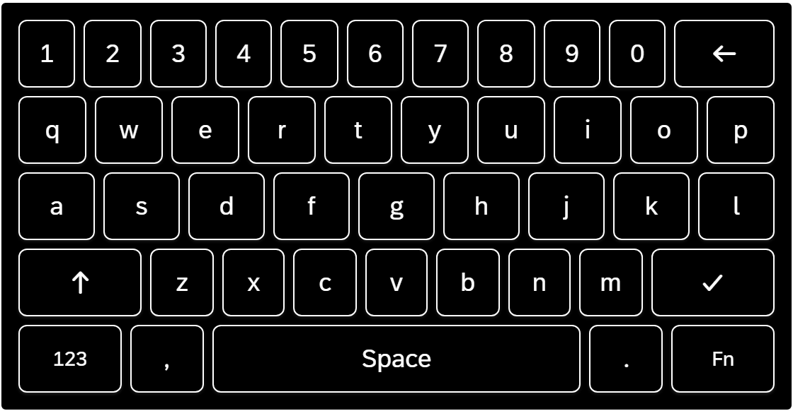
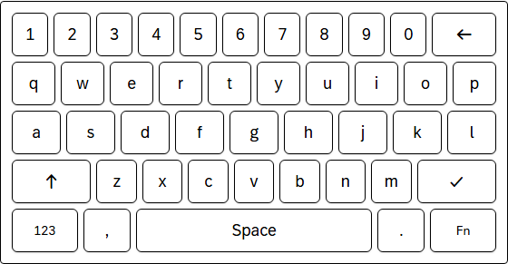

<h1 align="center">ui5-lib-keyboard</h1>

<p align="center">
UI5 TypeScript libraries for keyboard interaction in SAPUI5/OpenUI5 applications.
</p>

> [!CAUTION]
> Large parts of this project were _vibe coded_. I built it with heavy AI assistance while recovering from wrist surgery, one hand and speech-to-text only. If you find rough edges, that is probably why.

## Packages

| Package                                                 | Description                                                                                                       |
| ------------------------------------------------------- | ----------------------------------------------------------------------------------------------------------------- |
| [`ui5-lib-hotkeys`](./packages/hotkeys)                 | Declarative keyboard shortcut management: scopes, multi-key sequences, cross-platform modifiers, hotkey recording |
| [`ui5-lib-kiosk-keyboard`](./packages/kiosk-keyboard)   | On-screen virtual keyboard UI5 control: SAP theming, multiple layouts, docked/auto-show mode, touch support       |
| [`kiosk-keyboard-webc`](./packages/kiosk-keyboard-webc) | Native web component variant of the kiosk keyboard: framework-agnostic, built on UI5 Web Components               |
| [`demo-hotkeys-app`](./packages/demo-app)               | Demo application showcasing all libraries                                                                         |

## Kiosk Keyboard Theme Preview

Full-size inline keyboard:

| `sap_horizon`                                                                                       | `sap_horizon_dark`                                                                                            |
| --------------------------------------------------------------------------------------------------- | ------------------------------------------------------------------------------------------------------------- |
|  |  |

| `sap_horizon_hcb`                                                                                           | `sap_horizon_hcw`                                                                                           |
| ----------------------------------------------------------------------------------------------------------- | ----------------------------------------------------------------------------------------------------------- |
|  |  |

## Getting Started

This monorepo currently keeps all three library packages workspace-local (`private: true`).
For local development, install once at the repository root and use the package READMEs for API details:

```bash
npm install
```

If/when the packages are published, use the install commands below.
For full API details, see:

- **[ui5-lib-hotkeys README](./packages/hotkeys/README.md)**
- **[ui5-lib-kiosk-keyboard README](./packages/kiosk-keyboard/README.md)**
- **[kiosk-keyboard-webc README](./packages/kiosk-keyboard-webc/README.md)**

### Consumption Modes (UI5 Libraries)

Both UI5-native libraries (`ui5-lib-hotkeys` and `ui5-lib-kiosk-keyboard`) ship:

- the source UI5 project (`src/`, `ui5.yaml`) for source-first UI5 Tooling consumption
- prebuilt `dist/resources/...` artifacts, typings, and `dist/.ui5/build-manifest.json` for direct dist serving and tooling reuse

That enables 3 app-side consumption modes. No project shim is required.

#### 1. Installed package + UI5 Tooling (default)

Recommended for published/runtime usage.

Install the npm package, declare the library in `manifest.json`, and let UI5 Tooling resolve it from `node_modules`.

If your app build should copy the custom-library resources into the app `dist/`, add the UI5 project names to `builder.settings.includeDependency`:

```yaml
builder:
  settings:
    includeDependency:
      - ui5.hotkeys
      - ui5.kiosk
```

Use the UI5 project names shown by `ui5 tree --flat` (`ui5.hotkeys`, `ui5.kiosk`), not the npm package names.

If you deploy the built app to a plain static server while bootstrapping UI5 from CDN, map the custom-library namespaces to the copied `resources/` folders:

```html
<script
  id="sap-ui-bootstrap"
  src="https://sdk.openui5.org/resources/sap-ui-core.js"
  data-sap-ui-resource-roots='{
    "my.app": "./",
    "ui5.hotkeys": "./resources/ui5/hotkeys/",
    "ui5.kiosk": "./resources/ui5/kiosk/"
  }'
  data-sap-ui-on-init="module:sap/ui/core/ComponentSupport"
  data-sap-ui-async="true"
></script>
```

#### 2. Source package + UI5 Tooling transpilation

Recommended for monorepos and local development when you want to work against the library source instead of the prebuilt distributable.

Enable dependency transpilation in both the build task and dev server middleware:

```yaml
builder:
  customTasks:
    - name: ui5-tooling-transpile-task
      afterTask: replaceVersion
      configuration:
        transpileDependencies: true
        transformTypeScript:
          allowDeclareFields: true
server:
  customMiddleware:
    - name: ui5-tooling-transpile-middleware
      afterMiddleware: compression
      configuration:
        transpileDependencies: true
        transformTypeScript:
          allowDeclareFields: true
```

No `framework.libraries` entry is required for these custom libraries; keep them in `manifest.json` and use `includeDependency` only when your app build should copy them into `dist/`.

#### 3. Static middleware escape hatch

Use this when you want explicit runtime serving from the dependency distributables and do not want the dependency to participate in your app's UI5 dependency resolution.

```bash
npm install -D ui5-middleware-servestatic
```

```yaml
server:
  customMiddleware:
    - name: ui5-middleware-servestatic
      afterMiddleware: compression
      mountPath: /resources/ui5/hotkeys/
      configuration:
        npmPackagePath: ui5-lib-hotkeys/dist/resources/ui5/hotkeys
    - name: ui5-middleware-servestatic
      afterMiddleware: compression
      mountPath: /resources/ui5/kiosk/
      configuration:
        npmPackagePath: ui5-lib-kiosk-keyboard/dist/resources/ui5/kiosk
```

This is mainly a dev-server/runtime option. If you also need those resources inside the app build output, prefer mode 1 with `includeDependency`, or copy the resources explicitly as part of deployment.

In all 3 modes, keep the custom library declarations in your app `manifest.json`:

```json
{
  "sap.ui5": {
    "dependencies": {
      "libs": {
        "ui5.hotkeys": {},
        "ui5.kiosk": {}
      }
    }
  }
}
```

### Hotkeys

```bash
npm install ui5-lib-hotkeys
```

```ts
import HotkeyManager from "ui5/hotkeys/HotkeyManager";

const manager = HotkeyManager.getInstance();
const hotkeys = manager.createGroup();

hotkeys.register("Mod+S", () => onSave(), { description: "Save" });
```

### Kiosk Keyboard (UI5 Control)

```bash
npm install ui5-lib-kiosk-keyboard
```

```xml
<mvc:View xmlns:kiosk="ui5.kiosk" xmlns:m="sap.m" xmlns:mvc="sap.ui.core.mvc">
  <m:Input id="myInput" />
  <kiosk:KioskKeyboard targetInput="myInput" docked="true" autoShow="true" />
</mvc:View>
```

### Kiosk Keyboard (Web Component)

The web component variant (`kiosk-keyboard-webc`) provides the same virtual keyboard as a native custom element. Its consumption model is different from the native UI5 libraries:

- standalone apps: prefer `kiosk-keyboard-webc/bundle`
- advanced ESM setups: use `kiosk-keyboard-webc` with `kiosk-keyboard-webc/Assets`
- UI5 apps: resolve npm modules via `ui5-tooling-modules`, then choose CEM-driven wrapper consumption or a `WebComponent.extend()` bridge

```bash
# if/when published
npm install kiosk-keyboard-webc
```

```html
<script type="module">
  import "kiosk-keyboard-webc/bundle";
</script>

<input id="my-input" type="text" />
<kiosk-keyboard layout="qwerty" for="my-input"></kiosk-keyboard>
```

See the [kiosk-keyboard-webc README](./packages/kiosk-keyboard-webc/README.md) for the detailed consumption modes, UI5 integration notes, API reference, attributes, events, and custom layout examples.

## Using Hotkeys and the UI5 Kiosk Keyboard Together

The two UI5 libraries are independent (neither depends on the other) but they complement each other well. A typical kiosk application uses hotkeys for global shortcuts and the virtual keyboard for text input:

```xml
<mvc:View xmlns:kiosk="ui5.kiosk" xmlns:m="sap.m" xmlns:mvc="sap.ui.core.mvc">
  <m:Input id="searchField" placeholder="Search..." />
  <kiosk:KioskKeyboard docked="true" autoShow="true" targetInput="searchField" />
</mvc:View>
```

```ts
// Controller - register hotkeys alongside the virtual keyboard
import HotkeyManager from "ui5/hotkeys/HotkeyManager";

onInit(): void {
  const manager = HotkeyManager.getInstance();
  manager.register("Mod+K", () => this.byId("searchField")?.focus(), {
    description: "Focus search",
  });
}
```

Both UI5 libraries use standard UI5 lifecycle management (`destroy()`) and coexist on the same page without conflicts. The KioskKeyboard fires `keyPress` events (not native `keydown`), so virtual key taps do not trigger hotkeys registered via HotkeyManager.

## Development

Monorepo using npm workspaces. Requires Node >= 24.

```bash
npm install                 # Install all workspaces
npm run build               # Build library dist/ artifacts (required before starting the demo app)
```

### Dev Servers

| Command                      | Description                                   | Port |
| ---------------------------- | --------------------------------------------- | ---- |
| `npm start`                  | Demo app (alias for `start:demo`)             | 8080 |
| `npm run start:flp`          | Demo app in FLP sandbox (SAPUI5 + ushell)     | 8080 |
| `npm run start:hotkeys`      | Hotkeys QUnit test runner                     | 8081 |
| `npm run start:kiosk`        | Kiosk keyboard QUnit test runner              | 8082 |
| `npm run start:kiosk:visual` | Kiosk visual test page (same server as kiosk) | 8082 |
| `npm run start:kiosk-webc`   | Kiosk web component standalone demo (Vite)    | 8084 |

### Build

```bash
npm run build              # Build all libraries (hotkeys + kiosk + kiosk-webc)
npm run build:hotkeys      # Build hotkeys only
npm run build:kiosk        # Build kiosk-keyboard only
npm run build:kiosk-webc   # Build kiosk-keyboard-webc only
npm run build:demo         # Build demo app only
npm run build:all          # Build libraries + demo app
npm run clean              # Clean all dist outputs
```

### Test

```bash
# Core test suite (QUnit + desktop e2e + Vitest + Web Test Runner)
npm test                               # All core tests across all packages

# Per-package
npm run test:hotkeys                   # Hotkeys QUnit tests
npm run test:kiosk                     # Kiosk QUnit + desktop e2e tests
npm run test:kiosk:e2e                 # Kiosk desktop e2e only (no QUnit)
npm run test:kiosk-webc                # Kiosk webc unit tests (Vitest)
npm run test:kiosk-webc:component      # Kiosk webc integration tests (Web Test Runner)
npm run test:kiosk-webc:e2e            # Kiosk webc e2e tests (WebdriverIO)
npm run test:qunit                     # All QUnit tests only (hotkeys + kiosk)

# Multi-device e2e
npm run test:e2e:all-devices           # All e2e across all device profiles (kiosk + webc, concurrent)
npm run test:e2e:all-devices:sequential # Same matrix, but sequential for lower local CPU/RAM pressure
npm run test:kiosk:e2e:flp             # FLP lifecycle e2e tests (SAPUI5 sandbox)

# Contract / tooling smoke checks
npm run test:tools                      # Regression tests for custom oxlint fixers
npm run test:packages:smoke             # Build + npm pack dry-run smoke for publishable packages
npm run test:demo:webc-bundle           # Demo build smoke check for the public WebC bundle path

# Visual baseline management
npm run test:kiosk:e2e:update          # Update kiosk desktop visual baselines
npm run test:kiosk-webc:e2e:update     # Update webc desktop visual baselines
npm run test:e2e:all-devices:sequential # Re-run the full desktop + responsive matrix before accepting new baselines
npm run test:kiosk:e2e:docs            # Regenerate README kiosk screenshots

# For per-profile baseline updates (phone-sm / phone-md / phone-lg / tablet),
# use the package scripts documented in packages/kiosk-keyboard/README.md,
# packages/kiosk-keyboard-webc/README.md, or docs/shared/TESTING.md.

# Coverage (kiosk-keyboard-webc only)
npm run test:coverage -w packages/kiosk-keyboard-webc
```

### Code Quality

```bash
npm run check              # Full quality gate with smoke checks + sequential multi-device e2e
npm run check:parallel     # Same gate, but with the concurrent multi-device matrix
npm run fmt                # Format (oxfmt)
npm run fmt:check          # Check formatting without fixing
npm run lint               # Lint (oxlint)
npm run lint:fix           # Lint with auto-fix
npm run lint:ui5           # UI5 linter across all workspaces
npm run typecheck          # Typecheck all workspaces (incl. e2e tests)
```

## Project Structure

```
ui5-lib-keyboard/
├── packages/
│   ├── hotkeys/               # ui5-lib-hotkeys (ui5.hotkeys namespace)
│   ├── kiosk-keyboard/        # ui5-lib-kiosk-keyboard (ui5.kiosk namespace)
│   ├── kiosk-keyboard-webc/   # kiosk-keyboard-webc (native web component)
│   └── demo-app/              # Demo application
│       ├── ui5.yaml           # OpenUI5 dev server config (default)
│       └── ui5-flp.yaml       # SAPUI5 + FLP sandbox config (preview-middleware)
├── tools/                     # Custom oxlint JS plugins (code-quality, comment-quality, test-guardrails) and shared test infrastructure
├── patches/                   # Local dependency patches (patch-package), applied on npm install
└── docs/                      # Architecture & design documents
```

## Documentation

| Document                                                                       | Description                                           |
| ------------------------------------------------------------------------------ | ----------------------------------------------------- |
| [Glossary](./docs/GLOSSARY.md)                                                 | Shared terms and concepts across all packages         |
| [API Stability Policy](./docs/shared/API-STABILITY.md)                         | Stable vs internal import boundaries                  |
| [Multi-key Sequences](./docs/hotkeys/SEQUENCES.md)                             | Hotkeys sequence system design and rationale          |
| [Web Component Consumption](./docs/web-component-consumption.md)               | Build pipeline, exports, tag scoping, and limitations |
| [Consumption Research](./docs/shared/UI5-WEBCOMPONENT-CONSUMPTION-RESEARCH.md) | UI5 vs standalone consumption comparison              |
| [Docs Index](./docs/README.md)                                                 | Full index of all docs (incl. internal & historical)  |
| [Patches](./patches/README.md)                                                 | Local dependency patches applied via patch-package    |

## Contributing

Contributions are welcome. Whether you file a bug report, suggest a feature, or open a pull request, all input is appreciated.

- **Issues:** Use [GitHub Issues](https://github.com/wridgeu/ui5-lib-keyboard/issues) to report bugs or request features.
- **Pull Requests:** Fork the repo, create a branch, and open a PR against `main`. Please run `npm run check` before submitting to verify tests, linting, and formatting pass.
- **Questions:** Open a discussion or issue if something is unclear.

## License

[MIT](./LICENSE)
