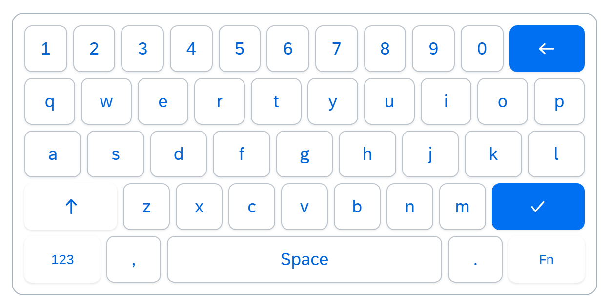
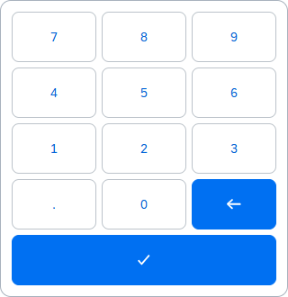
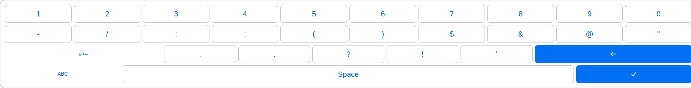
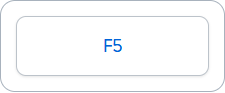
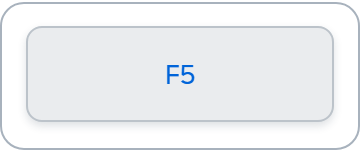
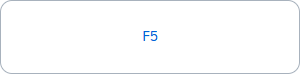
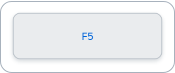
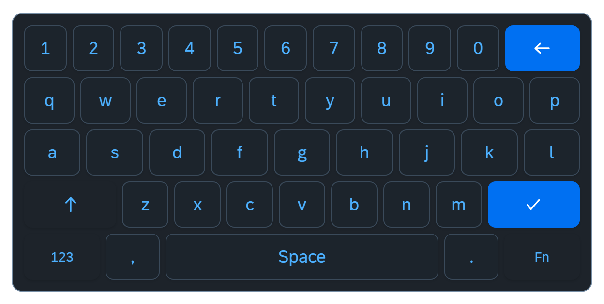
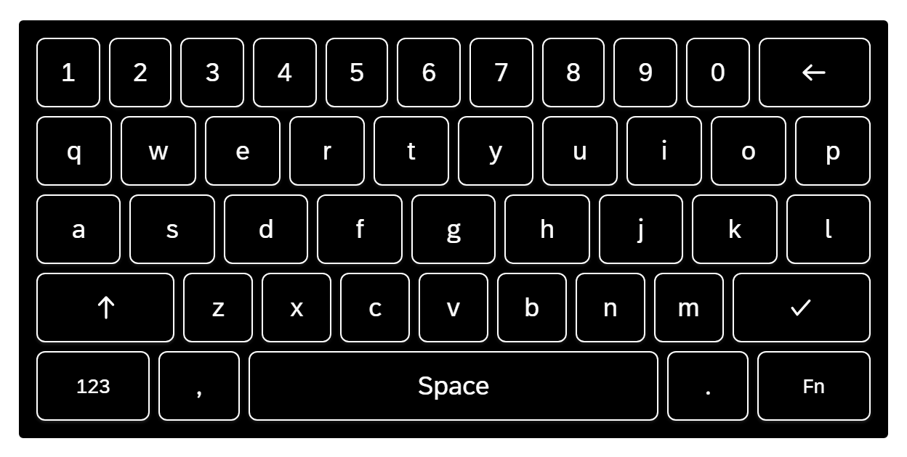
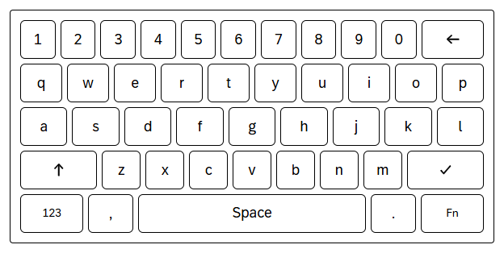

<p align="center">
  <a href="https://www.npmjs.com/package/kiosk-keyboard-webc"></a>
  <a href="https://npmx.dev/package/kiosk-keyboard-webc"></a>
  <a href="../../LICENSE"></a>
  <a href="https://ui5.github.io/webcomponents/"></a>
  <a href="https://www.typescriptlang.org/"></a>
</p>

<h1 align="center">kiosk-keyboard-webc</h1>

> Part of the [ui5-keyboard](../../README.md) monorepo. See also: [ui5-lib-hotkeys](../hotkeys/README.md) and [ui5-lib-kiosk-keyboard](../kiosk-keyboard/README.md).

Native web component variant of the kiosk on-screen keyboard, built on the [UI5 Web Components](https://ui5.github.io/webcomponents/) framework (`@ui5/webcomponents-base`).

```html
<kiosk-keyboard layout="qwerty" controls="my-input"></kiosk-keyboard>
```

## Features

- **Standards-based custom element** (`<kiosk-keyboard>`) usable in any framework: plain HTML, React, Vue, Angular
- **SAP theming**: Horizon light/dark, HCB, HCW via CSS variables (automatic theme switching)
- **UI5 app integration**: consumable inside UI5 apps via the existing `WebComponent.extend()` bridge pattern
- **Multiple layouts**: QWERTY, QWERTZ-DE, Japanese Romaji, Japanese Kana, Arabic, Korean Hangul, Spanish, Numeric, Numpad, Special, F-keys, Navigation. Composite variants (e.g., QWERTY + F-key row) are trivial to compose from building block rows.
- **Locale-aware**: auto-selects layout based on browser locale (e.g. `de` → `qwertz-de`, `ja` → `ja-romaji`, `ar` → `arabic`, `ko` → `ko-hangul`, `es` → `qwerty-es`). Set `instanceLocaleLayouts={ ja: "ja-kana" }` on an element to switch the Japanese default to kana input for that instance.
- **Shift / Caps Lock**: single-click for one-shot shift, double-click for caps lock
- **Docked mode**: fixed-position keyboard at bottom of viewport with slide animation
- **Auto-show**: opens/closes automatically when target inputs receive/lose focus
- **Auto-type detection**: switches to Numpad for `type="number"`, `inputmode="numeric"`, `data-keyboard-type="Numpad"`, etc.
- **F-key and navigation key support**: configurable modes: `Virtual`, `Native`, `None`
- **Grapheme-aware**: correct backspace/navigation for emoji and multi-code-unit characters
- **Accessible**: ARIA roles, labels, live region announcements, roving tabindex, keyboard navigation, `prefers-reduced-motion`, `forced-colors`
- **i18n**: built-in English/German/Japanese/Arabic, extensible via custom resolver
- **Custom layouts**: per-instance overrides via `instanceLayouts` / `instanceLocaleLayouts` / `instanceMiddleware` properties

## Keyboard Overview

QWERTY (Full):



Numpad:



Numeric:



### Key Types

Keys support different visual styles via the `type` property in `KeyDefinition`:

| Default                                                       | Default (hovered)                                                           | Modifier (`type: "modifier"`)                                   | Modifier (hovered)                                                            |
| ------------------------------------------------------------- | --------------------------------------------------------------------------- | --------------------------------------------------------------- | ----------------------------------------------------------------------------- |
|  |  |  |  |

- **Default**: visible border, `--sapButton_Background`. Used for character keys.
- **Modifier**: transparent background, no border (`--sapButton_Lite_Background`). Used for Shift, Caps Lock, layout switchers, F-keys (F1-F12), and navigation keys (Home, End, Arrows, PgUp, PgDn).
- **Action**: emphasized style (`--sapButton_Emphasized_Background`). Used for Enter, Backspace.

### Theme Preview

| `sap_horizon`                                                                      | `sap_horizon_dark`                                                                           |
| ---------------------------------------------------------------------------------- | -------------------------------------------------------------------------------------------- |
|  |  |

| `sap_horizon_hcb`                                                                          | `sap_horizon_hcw`                                                                          |
| ------------------------------------------------------------------------------------------ | ------------------------------------------------------------------------------------------ |
|  |  |

## Installation

Install from npm:

```bash
npm install kiosk-keyboard-webc
```

### Framework dependencies

This package depends on the UI5 Web Components framework (`@ui5/webcomponents`, `@ui5/webcomponents-base`, `@ui5/webcomponents-icons`, `@ui5/webcomponents-theming`) as regular `dependencies`, so they are installed automatically with `kiosk-keyboard-webc`; no separate install step is required.

If your app also uses UI5 Web Components directly (e.g., `@ui5/webcomponents` buttons, inputs), make sure your bundler dedupes a single instance of `@ui5/webcomponents-base` so the framework registries (custom elements, themes, i18n) are shared and duplicate-registration errors are avoided. This package's Vite build already dedupes `@ui5/webcomponents-base`.

### Tree-Shaking

The package declares a `sideEffects` field in `package.json` so that bundlers (Vite/Rollup, webpack) can correctly handle side-effectful modules during tree-shaking (see [Rollup side effects](https://rollupjs.org/configuration-options/#treeshake-modulesideeffects)). Only the genuinely side-effectful modules are listed: theme/i18n asset registration (`Assets`, `generated/**`) and the convenience bundle entry (`bundle.esm`).

> [!NOTE]
> All built-in layouts and their composition middleware (kana, Hangul) are pure data/factory modules that the registries (`core/layout-registry`, `core/middleware-registry`) statically import and reference. They are therefore always included in the bundle through normal tree-shaking, so no `sideEffects` marker is required.

In this monorepo, install all workspace dependencies once at the repository root:

```bash
npm install
```

## Browser Compatibility

The keyboard requires modern browser features for full functionality:

| Feature               | Used for                 | Baseline                                |
| --------------------- | ------------------------ | --------------------------------------- |
| CSS Container Queries | Width-responsive sizing  | Chrome 105+, Firefox 110+, Safari 16+   |
| ResizeObserver        | Height-responsive sizing | Chrome 64+, Firefox 69+, Safari 13.1+   |
| CSS `min()` / `max()` | Font-size capping        | Chrome 79+, Firefox 75+, Safari 13.1+   |
| CSS Custom Properties | Consumer overrides       | Chrome 49+, Firefox 31+, Safari 9.1+    |
| CSS `color-mix()`     | Theme-adaptive shadows   | Chrome 111+, Firefox 113+, Safari 16.2+ |
| Shadow DOM v1         | Component encapsulation  | Chrome 53+, Firefox 63+, Safari 10+     |

All features are supported in browsers released since mid-2023. In older
browsers, the keyboard renders at full size without width-responsive font
scaling. Shadow colors fall back to static `rgba()` values.

## Consumption Modes

### 1. Standalone via `kiosk-keyboard-webc/bundle` (recommended)

Recommended for plain HTML, React, Vue, Angular, and most non-UI5 apps.

`kiosk-keyboard-webc/bundle` is the convenience entry point. It imports `Assets`, registers the custom element, loads theme and i18n assets, and inserts the SAP "72" font face.

> [!NOTE]
> The examples below use bare package specifiers (`kiosk-keyboard-webc/…`), which require a bundler (Vite, webpack, etc.) or an [import map](https://developer.mozilla.org/en-US/docs/Web/HTML/Reference/Elements/script/type/importmap). For plain `<script>` usage without a build step, replace the specifier with the resolved path to `dist/kiosk-keyboard.bundle.js` (for example `./node_modules/kiosk-keyboard-webc/dist/kiosk-keyboard.bundle.js`).

> [!NOTE]
> The element is **client-only**: importing the bundle runs `customElements.define()` and registers the SAP font at module load, which throws during server-side rendering (Next.js, Nuxt, Analog). In an SSR framework, import it on the client only - e.g. Next.js `dynamic(() => import("kiosk-keyboard-webc/bundle"), { ssr: false })`, or import inside `useEffect` / `onMounted`.

```html
<script type="module">
  import "kiosk-keyboard-webc/bundle";
</script>

<input id="my-input" type="text" />
<kiosk-keyboard layout="qwerty" controls="my-input"></kiosk-keyboard>
```

```ts
import { KioskKeyboard } from "kiosk-keyboard-webc/bundle";
```

### 2. Advanced ESM via `kiosk-keyboard-webc` + `kiosk-keyboard-webc/Assets`

Use this when your app already manages UI5 Web Components dependencies and you want the bare component class entry point.

```ts
import "kiosk-keyboard-webc/Assets";
import KioskKeyboard from "kiosk-keyboard-webc";
```

Use this mode when you want to avoid the convenience bundle and keep control over how the component is composed into your app build. `Assets` is required here because the bare `kiosk-keyboard-webc` entry exports the component class only.

> [!IMPORTANT]
> **Font loading:** `kiosk-keyboard-webc/bundle` already imports `kiosk-keyboard-webc/Assets`, which in turn loads the SAP "72" font via `@ui5/webcomponents-base/dist/FontFace.js` and registers theme/i18n assets. If you use the bare `kiosk-keyboard-webc` entry directly, import `kiosk-keyboard-webc/Assets` yourself and make sure the "72" font is available (for example via the UI5 framework, `FontFace.js`, or a custom `@font-face` declaration).
>
> **Custom fonts:** If you override `--sapFontFamily` or set a custom `font-family` on the keyboard, the default key sizing may not fit the new font's glyph metrics. You may need to adjust `--kiosk-keyboard-key-height`, `--kiosk-keyboard-key-font-size`, or `--kiosk-keyboard-key-padding` to prevent clipping or excessive whitespace.

### 3. Inside a UI5 app

This package is not a native UI5 library, so the UI5-app story is different from `ui5-lib-hotkeys` / `ui5-lib-kiosk-keyboard`.

For UI5 apps, make sure your app can resolve npm ESM packages via `ui5-tooling-modules` in `ui5.yaml`. There are two integration paths:

#### 3a. Seamless Web Components (CEM-driven, recommended)

Published builds include `dist/custom-elements.json` (the Custom Elements Manifest), and the package declares the `customElements` field in `package.json`. The `ui5-tooling-modules` middleware reads this manifest and auto-generates a `sap.ui.core.webc.WebComponent` wrapper at serve/build time. No manual wrapper code needed.

```yaml
# ui5.yaml - config for seamless web component consumption
builder:
  customTasks:
    - name: ui5-tooling-modules-task
      afterTask: replaceVersion
      configuration:
        addToNamespace: true
server:
  customMiddleware:
    - name: ui5-tooling-transpile-middleware
      afterMiddleware: compression
    - name: ui5-tooling-modules-middleware
      afterMiddleware: ui5-tooling-transpile-middleware
      configuration:
        addToNamespace: true
        useRelativeModulePaths: true
```

Then use the component directly in XML views:

```xml
<mvc:View xmlns:kb="kiosk-keyboard-webc">
  <kb:KioskKeyboard layout="qwerty" docked="true" />
</mvc:View>
```

In workspace development, run `npm run build` (or at least `npm run generateAPI`) in the webc package first so that `dist/custom-elements.json` exists. The CEM is produced by `generateAPI`; `npm run generate` only emits the CSS and i18n assets, not the manifest.

The framework version declared in `ui5.yaml` must be >= 1.120.0 for the seamless web component transformation to activate. The [SAP-samples/uxc-integration](https://github.com/SAP-samples/uxc-integration) project is the official reference for the build-time configuration (`addToNamespace: true` on the task).

`useRelativeModulePaths: true` is needed for dev serve. Without it, the middleware redirects module requests to a namespace-prefixed path (`demo/hotkeys/thirdparty/...`) that only exists after `ui5 build`. During dev serve, modules are stored under their original npm names and the redirect target does not resolve. This is intentional middleware design ([ui5-community/ui5-ecosystem-showcase#1049](https://github.com/ui5-community/ui5-ecosystem-showcase/issues/1049)); the namespace rewriting of entry-point modules is a build-only step. `useRelativeModulePaths: true` skips the redirect and serves modules at their npm paths directly. See [`UI5-WEBCOMPONENT-CONSUMPTION-RESEARCH.md`](../../docs/shared/UI5-WEBCOMPONENT-CONSUMPTION-RESEARCH.md) for a full path-mapping reference.

The demo app in this repository uses Path A (CEM-driven) for the `kiosk-keyboard` web component. The manual bridge (Path B below) is documented as a reference for consumers who need explicit metadata control.

#### 3b. `WebComponent.extend()` bridge (reference)

For full control over the UI5 metadata surface, create a manual bridge using `WebComponent.extend()`. This gives explicit property/event/method/association mappings and typed UI5 events. Since UI5 >= 1.138, camelCase event names in `metadata.events` auto-convert to kebab-case DOM events (e.g. `keyPress` maps to `key-press`), so explicit `mapping: { to: "..." }` on events is not needed.

```ts
import WebComponent from "sap/ui/core/webc/WebComponent";
import "kiosk-keyboard-webc/bundle";

const KioskKeyboardWebc = WebComponent.extend("my.control.KioskKeyboard", {
  metadata: {
    tag: "kiosk-keyboard",
    properties: {
      layout: { type: "string", defaultValue: "", mapping: { type: "property", to: "layout" } },
      docked: { type: "boolean", defaultValue: false, mapping: { type: "property", to: "docked" } },
      // ... additional property/event/method/association mappings
    },
  },
});
```

Use the bridge when you want predictable XML view metadata, typed UI5 events, or imperative methods such as `show()` / `close()` exposed as a UI5 control API.

### Choosing between the UI5 control and the web component

| Criterion         | `ui5-lib-kiosk-keyboard` (UI5 control)                       | `kiosk-keyboard-webc` (web component)                                    |
| ----------------- | ------------------------------------------------------------ | ------------------------------------------------------------------------ |
| **Framework**     | SAPUI5 / OpenUI5 only                                        | Any (plain HTML, React, Vue, Angular, UI5 via wrapper/bridge)            |
| **Theming**       | LESS variables (`@sapUiButton*`)                             | CSS custom properties + SAP theme token fallbacks                        |
| **i18n**          | UI5 ResourceBundle + `setI18nResolver()` callback            | Built-in EN/DE/JA/AR + `setI18nResolver()` callback                      |
| **Target inputs** | `controls` property + `setControls()` + `getActiveControl()` | `controls` attribute + `setTargetElement()` + `getActiveTargetElement()` |
| **Density**       | UI5 content density (`sapUiSizeCompact`)                     | `data-ui5-compact-size` attribute                                        |

Both packages share the same layout definitions (`KeyDefinition`, `LayoutDefinition`), the same per-instance customization properties (`instanceLayouts`, `instanceLocaleLayouts`, `instanceMiddleware`), and the same special-key syntax (`{shift}`, `{backspace}`, `{layout:name}`). Custom layouts work identically across both.

Event naming follows platform conventions: `keyPress` (camelCase) in the UI5 control vs `key-press` (kebab-case) in the web component. Event payloads are structurally identical.

See [`UI5-WEBCOMPONENT-CONSUMPTION-RESEARCH.md`](../../docs/shared/UI5-WEBCOMPONENT-CONSUMPTION-RESEARCH.md) for general guidance on web component consumption patterns inside UI5 apps.

## API Stability

Recommended stable consumer entry points and imports:

```ts
import { KioskKeyboard, FKeyMode, KeyboardType, MobileKeyboard } from "kiosk-keyboard-webc/bundle";

import type {
  KeyPressEventDetail,
  LayoutChangeEventDetail,
  KeyboardTypeChangeEventDetail,
  ActiveControlChangeEventDetail,
  KeyDefinition,
  KeyRow,
  LayoutDefinition,
  KeyWidth,
  KeyType,
  SpecialKeyValue,
} from "kiosk-keyboard-webc/bundle";
```

For most applications, prefer `kiosk-keyboard-webc/bundle`. The bare `kiosk-keyboard-webc` entry point is also supported for advanced setups when paired with `kiosk-keyboard-webc/Assets`.

Customization is per element via the `instanceLayouts`, `instanceLocaleLayouts`, and `instanceMiddleware` properties. The remaining static methods on `KioskKeyboard` are read-only inspectors (`getRegisteredLayout`, `getRegisteredLayoutNames`, `isBuiltInLayout`, `isSecondaryLayout`, `getLocaleLayout`) plus the global `setI18nResolver`. Import the class and call them directly:

```js
import { KioskKeyboard } from "kiosk-keyboard-webc/bundle";

const qwerty = KioskKeyboard.getRegisteredLayout("qwerty");
KioskKeyboard.setI18nResolver((key) => undefined);
```

Internal modules under `core/*` (e.g. `shift-state`, `dom-utils`, `input-operations`, `layout-registry`) are implementation details and may change without notice. Individual layout files under `layouts/*` are likewise internal; layouts are consumed by name through the `layout` attribute or the `instanceLayouts` property. The two shared row modules (`kiosk-keyboard-webc/layouts/fkey-row`, `kiosk-keyboard-webc/layouts/nav-row`) are stable imports for composing custom variant layouts. Their keys are declared as `type: "modifier"` (the transparent Lite button style); override `type` on individual keys if you want the default bordered style instead.

> [!NOTE]
> See the [API Stability Policy](../../docs/shared/API-STABILITY.md) for full details on stable vs internal import boundaries across all packages.

## Attributes / Properties

| Attribute             | Property                | Type                                                  | Default     | Description                                                                                                                 |
| --------------------- | ----------------------- | ----------------------------------------------------- | ----------- | --------------------------------------------------------------------------------------------------------------------------- |
| `layout`              | `layout`                | `string`                                              | `""`        | Layout name (e.g. `qwerty`, `qwertz-de`). Empty = auto-detect from locale.                                                  |
| `keyboard-type`       | `keyboardType`          | `string`                                              | `"Full"`    | `"Full"`, `"Numpad"`, or `"Numeric"`.                                                                                       |
| `open`                | `open`                  | `boolean`                                             | `false`     | Opens/closes the docked keyboard. Equivalent to `show()`/`close()`.                                                         |
| `docked`              | `docked`                | `boolean`                                             | `false`     | Fixed-position mode at bottom of viewport.                                                                                  |
| `auto-show`           | `autoShow`              | `boolean`                                             | `false`     | Auto open/close when target inputs gain/lose focus (requires `docked`).                                                     |
| `auto-type`           | `autoType`              | `boolean`                                             | `false`     | Auto-detect keyboard type from focused input's type/inputmode.                                                              |
| `disabled`            | `disabled`              | `boolean`                                             | `false`     | Disables all key interaction.                                                                                               |
| `controls`            | `controls`              | `string`                                              | `""`        | Comma-separated IDs of target elements. Supports single or multiple inputs.                                                 |
| `accessible-name`     | `accessibleName`        | `string`                                              | `""`        | Custom ARIA label for the keyboard. Falls back to i18n "Virtual Keyboard".                                                  |
| `mobile-keyboard`     | `mobileKeyboard`        | `string`                                              | `"Auto"`    | `"Auto"` (defer to native on touch), `"Custom"`, or `"Native"`.                                                             |
| `f-key-mode`          | `fKeyMode`              | `string`                                              | `"Virtual"` | `"Virtual"` (fire event + move cursor), `"Native"` (dispatch keydown), `"None"`.                                            |
| _(programmatic only)_ | `instanceLayouts`       | `Record<string, LayoutDefinition> \| null`            | `null`      | Per-instance layout overrides; shadow the built-in registry. See [Per-Instance Customization](#per-instance-customization). |
| _(programmatic only)_ | `instanceLocaleLayouts` | `Record<string, string> \| null`                      | `null`      | Per-instance locale-to-layout mappings; shadow the built-in locale map.                                                     |
| _(programmatic only)_ | `instanceMiddleware`    | `Record<string, () => CompositionMiddleware> \| null` | `null`      | Per-instance composition middleware factories keyed by layout name.                                                         |

### Keyboard type override via `data-keyboard-type`

When `auto-type` is enabled, the keyboard detects the type from `inputmode` and `type` attributes. For cases where these don't convey the right keyboard type (e.g., composite web component hosts), you can set an explicit override via the `data-keyboard-type` attribute on the input or any ancestor element:

```html
<!-- Force Numpad for a custom control -->
<my-amount-field data-keyboard-type="Numpad">
  <input type="text" />
</my-amount-field>

<!-- Force Full keyboard even for type="number" -->
<input type="number" data-keyboard-type="Full" />
```

Valid values: `"Full"`, `"Numpad"`. This attribute takes priority over `inputmode` and `type` detection.

## Events

| Event                   | Detail                                                                          | Description                                                                                                                                                                       |
| ----------------------- | ------------------------------------------------------------------------------- | --------------------------------------------------------------------------------------------------------------------------------------------------------------------------------- |
| `key-press`             | `{ key: string, shiftKey: boolean, char?: string }`                             | Fired on key click. Cancelable. `char` is the resolved character (after shift); `undefined` for action/F-keys.                                                                    |
| `after-open`            | `{ activeElement: HTMLInputElement \| HTMLTextAreaElement \| null }`            | Fired when the docked keyboard enters the open state. `activeElement` is the input that's now active. State-change hook only; not a CSS transition-end event.                     |
| `after-close`           | `{ activeElement: HTMLInputElement \| HTMLTextAreaElement \| null }`            | Fired when the docked keyboard enters the closed state. `activeElement` is the input that was active just before closing. State-change hook only; not a CSS transition-end event. |
| `layout-change`         | `{ layout: string }`                                                            | Fired when layout switches.                                                                                                                                                       |
| `keyboard-type-change`  | `{ keyboardType: string, previousKeyboardType: string, autoDetected: boolean }` | Fired when keyboard type changes.                                                                                                                                                 |
| `active-control-change` | `{ activeElement: HTMLInputElement \| HTMLTextAreaElement \| null }`            | Fired when the active control changes (auto-show focus switch or programmatic `setTargetElement`).                                                                                |

## Methods

| Method                     | Description                                                                                                                                                                                           |
| -------------------------- | ----------------------------------------------------------------------------------------------------------------------------------------------------------------------------------------------------- |
| `show()`                   | Opens the docked keyboard (sets `open = true`) when the current `mobileKeyboard` mode allows custom rendering. Logs a warning if `docked` is `false`.                                                 |
| `close()`                  | Closes the docked keyboard (sets `open = false`).                                                                                                                                                     |
| `setTargetElement(el)`     | Programmatically sets the target input/textarea.                                                                                                                                                      |
| `setTargetResolver(fn)`    | Sets a custom resolver to locate the native input/textarea inside a host element. Pass `null` to clear.                                                                                               |
| `resetKeyboardType()`      | Resets keyboard type to `"Full"` and re-enables auto-type detection.                                                                                                                                  |
| `refreshResponsiveState()` | Recomputes responsive height classes after runtime styling changes that do not emit a reliable resize signal. Usually not needed for normal container resizing.                                       |
| `insertText(text)`         | Inserts text at the caret of the active target (cursor-tracked, dispatches a native `input` event). No-op with no active target. Call from a `key-press` handler to implement a custom `{token}` key. |
| `deleteBackward()`         | Deletes one grapheme before the caret of the active target. Returns whether anything was removed; no-op with no active target.                                                                        |
| `getActiveTargetElement()` | Returns the resolved native input/textarea of the active target, or `null` (re-resolves each call). Mirrors the UI5 control's method of the same name.                                                |

## Static API

The static surface is read-only. Customization is per element via the `instanceLayouts`, `instanceLocaleLayouts`, and `instanceMiddleware` properties (see [Per-Instance Customization](#per-instance-customization)).

| Method                                     | Description                                                                                                            |
| ------------------------------------------ | ---------------------------------------------------------------------------------------------------------------------- |
| `KioskKeyboard.getRegisteredLayout(name)`  | Returns a built-in layout definition by name.                                                                          |
| `KioskKeyboard.getRegisteredLayoutNames()` | Returns all built-in layout names.                                                                                     |
| `KioskKeyboard.isBuiltInLayout(name)`      | Checks if a layout is built-in.                                                                                        |
| `KioskKeyboard.isSecondaryLayout(name)`    | Checks if a layout is secondary (non-alphabetic).                                                                      |
| `KioskKeyboard.getLocaleLayout()`          | Returns the layout for the active UI5 Web Components locale (configured language, falling back to the browser locale). |
| `KioskKeyboard.setI18nResolver(fn)`        | Sets a custom i18n resolver callback.                                                                                  |

`KioskKeyboard.DOM` is a supported read-only DOM hook contract for tests and DOM assertions. Prefer it over hard-coded shadow selectors. Styling customizations should still use the documented host attributes and public `--kiosk-keyboard-*` CSS custom properties.

## DOM Contract

Use `KioskKeyboard.DOM` when you need stable selectors for tests or DOM assertions:

```ts
import { KioskKeyboard } from "kiosk-keyboard-webc/bundle";
import type { KioskKeyboardDomContract } from "kiosk-keyboard-webc/bundle";

const DOM: KioskKeyboardDomContract = KioskKeyboard.DOM;
const firstKey = keyboard.shadowRoot?.querySelector(DOM.selectors.key);
```

The contract is intentionally read-only. It is not the styling API; continue to customize appearance through the documented public CSS custom properties.

## Built-in Layouts

| Name        | Description                                        |
| ----------- | -------------------------------------------------- |
| `qwerty`    | Standard US QWERTY                                 |
| `qwertz-de` | German QWERTZ with umlauts and ss                  |
| `ja-romaji` | Japanese Romaji (QWERTY base with JIS punctuation) |
| `ja-kana`   | Japanese Kana direct-input (JIS X 6002)            |
| `arabic`    | Arabic (standard Arabic 101 layout)                |
| `numeric`   | Numbers + common symbols                           |
| `special`   | Extended symbols (`#+=`, currencies)               |
| `numpad`    | Calculator-style number pad                        |
| `fkeys`     | F1-F12 function keys                               |
| `nav`       | Navigation keys (arrows, Home, End, etc.)          |
| `ko-hangul` | Korean Hangul Dubeolsik (KS X 5002)                |
| `qwerty-es` | Spanish QWERTY with accented vowels and ñ          |

Combined variants (e.g., QWERTY + F-key row) are not built-in. They are
trivial compositions - see [Layout Composition](#layout-composition) above.

## Custom Layouts

Custom layouts are scoped to a single `<kiosk-keyboard>` element via the `instanceLayouts` property:

```ts
import "kiosk-keyboard-webc/bundle";

const el = document.createElement("kiosk-keyboard");
el.instanceLayouts = {
  "my-layout": [
    [{ value: "a" }, { value: "b" }, { value: "c" }, { value: "{backspace}", type: "action" }],
    [
      { value: " ", width: "space", type: "space" },
      { value: "{enter}", type: "action" },
    ],
  ],
};
el.layout = "my-layout";
el.setAttribute("controls", "my-input");
document.body.appendChild(el);
```

Or in plain HTML, set the property after the element is defined:

```html
<script type="module">
  import "kiosk-keyboard-webc/bundle";

  customElements.whenDefined("kiosk-keyboard").then(() => {
    const el = document.querySelector("kiosk-keyboard");
    el.instanceLayouts = {
      "pin-pad": [
        [{ value: "1" }, { value: "2" }, { value: "3" }],
        [{ value: "4" }, { value: "5" }, { value: "6" }],
        [{ value: "7" }, { value: "8" }, { value: "9" }],
        [{ value: "{backspace}", type: "action" }, { value: "0" }, { value: "{enter}", type: "action" }],
      ],
    };
    el.layout = "pin-pad";
  });
</script>

<input id="my-input" type="text" />
<kiosk-keyboard controls="my-input"></kiosk-keyboard>
```

> [!NOTE]
> `instanceLayouts` accepts a JS object, not a string, so it cannot be set via an HTML attribute. Assign it programmatically before connecting the element (or before the next render cycle). Layouts assigned this way are scoped to the element that owns them.

Each key is a `KeyDefinition`:

```ts
interface KeyDefinition {
  value: string; // Character to insert, or action like "{shift}", "{enter}", "{backspace}", "{layout:numeric}", "{fkey:F5}"
  label?: string; // Display label; omit for auto-resolve (i18n for special keys, value for regular); "" suppresses
  shiftLabel?: string; // Label when shifted
  shiftValue?: string; // Value when shifted (defaults to value.toUpperCase() for single chars)
  capsLockLabel?: string; // Label for {shift} key in Caps Lock state; omit for i18n "Caps Lock"; "" suppresses
  capsLockIcon?: string; // Icon for {shift} key in Caps Lock state; independent of icon; defaults to locked icon
  width?: KeyWidth; // "1.25" | "1.5" | "1.75" | "2" | "2.25" | "2.75" | "space"
  type?: KeyType; // "default" | "modifier" | "action" | "space"
  icon?: string; // SAP icon URI or Unicode char/emoji; renders inline with label when both present
  ariaLabel?: string; // Accessible name when the key has no visible label (icon-only); resolution: ariaLabel -> label -> built-in i18n. Set this for icon-only custom keys ({paste} etc.)
}
```

## Per-Instance Customization

Every `<kiosk-keyboard>` accepts three programmatic-only properties that override the built-in registry for that element only: `instanceLayouts`, `instanceLocaleLayouts`, and `instanceMiddleware`. Resolution order is **instance map → built-in**, so an entry on the element wins without mutating module-level state.

```ts
const el = document.createElement("kiosk-keyboard");
el.instanceLayouts = { "warehouse-pos": warehousePosLayout };
el.instanceLocaleLayouts = { de: "warehouse-pos-de" };
el.instanceMiddleware = { "ja-kana": kanaDakutenFactory };
el.layout = "warehouse-pos";
document.body.appendChild(el);
```

These properties accept JS objects, not strings, so they cannot be set via HTML attributes - assign them programmatically before connecting the element (or before the next render cycle).

No teardown is needed: the overrides live on the element and are released when the host application removes it. The component does not maintain any window-global mutable customization state, so multiple apps sharing the same page (Fiori Launchpad, micro-frontends) cannot pollute each other through the keyboard.

## Function Keys (F1-F12)

### F-key modes

The `f-key-mode` attribute controls how function key presses are handled:

| Value       | Behavior                                                                                                                                                                                                                                                                |
| ----------- | ----------------------------------------------------------------------------------------------------------------------------------------------------------------------------------------------------------------------------------------------------------------------- |
| `"Virtual"` | (default) F-key press fires the `key-press` event only. No keyboard event is sent to the target input. Navigation keys move the caret in the target input (`ArrowLeft`/`ArrowRight`, `ArrowUp`/`ArrowDown`, `Home`/`PageUp` to the start, `End`/`PageDown` to the end). |
| `"Native"`  | F-key press dispatches a synthetic `KeyboardEvent("keydown")` to the target input, then fires `key-press`. The component also provides built-in workarounds for F5 and F11 (see below).                                                                                 |
| `"None"`    | F-key and navigation presses are ignored (silent no-op); the row is still rendered.                                                                                                                                                                                     |

### Native mode: synthetic keydown events

When `f-key-mode="Native"`, the component dispatches a synthetic `keydown` event to the target input for all F-keys (F1-F12) and navigation keys (ArrowUp, ArrowDown, ArrowLeft, ArrowRight, Home, End, PageUp, PageDown).

> [!IMPORTANT]
> Browsers treat synthetic `KeyboardEvent` instances as untrusted (`isTrusted: false`) and block them from triggering security-sensitive browser actions. A synthetic F5 keydown does **not** reload the page. A synthetic F11 does **not** toggle fullscreen.

To work around this limitation, the component has built-in action handlers for exactly two keys:

- **F5**: calls `location.reload()`
- **F11**: toggles fullscreen via `document.requestFullscreen()` / `document.exitFullscreen()`

All other F-keys (F1-F4, F6-F10, F12) dispatch the synthetic `keydown` to the target input but have no built-in browser action beyond what the app handles.

### Handling F-keys in consumer code

For any F-key the app wants to act on, listen to the `key-press` event. The `key` detail contains the bare key name (the `{fkey:*}` wrapping is stripped before dispatch, matching the names used by `KeyboardEvent.key`):

```typescript
keyboard.addEventListener("key-press", (e) => {
  const { key } = e.detail;
  if (key === "F1") {
    e.preventDefault(); // optional: suppress default key-press behavior
    showHelpDialog();
  }
});
```

> [!NOTE]
> Layout-switch keys (`{layout:*}`) fire `key-press` with the wrapped form (`"{layout:numeric}"`, `"{layout:base}"`) so consumers can distinguish the layout-switch action from a literal text key. This is asymmetric with F-keys for historical reasons; consult `e.detail.key` directly.

When `f-key-mode="Native"`, the cancelable `key-press` event fires **first**; the synthetic `keydown` is dispatched to the target input only if no handler calls `preventDefault()`. This means a global keyboard shortcut system listening on the document (for example, a hotkeys library) sees the F-key event only when the `key-press` handler does not call `preventDefault()` - cancelling `key-press` suppresses the native dispatch entirely.

To suppress the built-in F5 reload or F11 fullscreen actions specifically, call `preventDefault()` on the `key-press` event:

```typescript
keyboard.addEventListener("key-press", (e) => {
  if (e.detail.key === "F5") {
    e.preventDefault(); // prevent location.reload()
    myApp.refreshData();
  }
});
```

## Subpath Imports

The default entry (`kiosk-keyboard-webc`) includes all built-in layouts. The package also exposes subpath imports for layout definitions, middleware, the convenience bundle entry, asset registration, and the custom-elements manifest:

| Import                                  | Description                                                                                                                  |
| --------------------------------------- | ---------------------------------------------------------------------------------------------------------------------------- |
| `kiosk-keyboard-webc`                   | Full entry (all built-in layouts)                                                                                            |
| `kiosk-keyboard-webc/layouts/<name>`    | Built-in layout definitions (data for custom composition)                                                                    |
| `kiosk-keyboard-webc/middleware/<name>` | Composition middleware                                                                                                       |
| `kiosk-keyboard-webc/bundle`            | Convenience entry: element + Assets (needs a bundler/import map; for a plain `<script>` use `dist/kiosk-keyboard.bundle.js`) |
| `kiosk-keyboard-webc/Assets`            | Theme + i18n registration                                                                                                    |
| `kiosk-keyboard-webc/customElements`    | Custom Elements Manifest (`custom-elements.json`) for IDE/tooling                                                            |

### Layout Composition

The package ships primary layouts and building block rows (`fkey-row`, `nav-row`).
Combined layouts (e.g., QWERTY + F-key row) are not built-in - they are trivial
compositions consumers can build:

```ts
import { KioskKeyboard } from "kiosk-keyboard-webc/bundle";
import fkeyRow from "kiosk-keyboard-webc/layouts/fkey-row";

const qwerty = KioskKeyboard.getRegisteredLayout("qwerty")!;

const el = document.createElement("kiosk-keyboard");
el.instanceLayouts = { "my-qwerty-fk": [fkeyRow, ...qwerty] };
el.layout = "my-qwerty-fk";
document.body.appendChild(el);
```

## Composition Middleware

Some scripts require processing between key press and text insertion. For example, Japanese Kana needs dakuten/handakuten composition (ka + dakuten = ga), and Korean Hangul needs jamo-to-syllable composition (individual consonants and vowels combine into syllable blocks).

Composition middleware handles this automatically. The built-in kana and Hangul middleware are **bundled with the component**: no import or configuration is needed. Each activates automatically when its associated layout (`ja-kana` / `ko-hangul`) is active and deactivates (committing any in-progress composition) on layout switch.

The `kiosk-keyboard-webc/middleware/*` subpaths export the middleware **factories as data**, so you can reuse or override a built-in on a specific element via the [`instanceMiddleware`](#per-instance-customization) property; importing them has no side effect on the bundled defaults.

### Built-in Middleware

| Module                                          | Layout      | Behavior                                                 |
| ----------------------------------------------- | ----------- | -------------------------------------------------------- |
| `kiosk-keyboard-webc/middleware/kana-dakuten`   | `ja-kana`   | Composes base kana + dakuten/handakuten into voiced kana |
| `kiosk-keyboard-webc/middleware/hangul-compose` | `ko-hangul` | Composes jamo into Hangul syllable blocks with preedit   |

### Custom Middleware

Implement the `CompositionMiddleware` interface and supply the factory via the per-instance `instanceMiddleware` property keyed by layout name:

```ts
import type { CompositionMiddleware } from "kiosk-keyboard-webc";
import "kiosk-keyboard-webc/bundle";

function createMyMiddleware(): CompositionMiddleware {
  return {
    handleKey(key, target) {
      // Return true if consumed (keyboard skips default handling).
      // Return false to pass through to default behavior.
      return false;
    },
    commit() {
      // Force-commit any in-progress composition. Return committed text or null.
      return null;
    },
    reset() {
      // Clear state without committing.
    },
  };
}

const el = document.createElement("kiosk-keyboard");
el.instanceMiddleware = { "my-layout": createMyMiddleware };
el.layout = "my-layout";
document.body.appendChild(el);
```

The `handleKey` method receives:

- `key`: the raw key value from the layout definition (e.g., `"a"`, `"{backspace}"`, `"{enter}"`)
- `target`: the input element the keyboard is typing into

When `handleKey` returns `true`, the keyboard skips its default text insertion, backspace, and enter handling. The middleware is responsible for modifying the target's value.

Middleware lifecycle:

- **Layout switch**: `commit()` is called, instance discarded. A fresh instance is created when the layout activates again.
- **Component destroyed**: `reset()` is called. In-progress composition is discarded, not flushed.
- **Focus change**: `commit()` is called to avoid orphaned preedit text.

> [!NOTE]
> An entry in `instanceMiddleware` shadows the built-in factory for the same layout (for example, set `{ "ja-kana": myFactory }` to replace the bundled kana-dakuten middleware on that element).

## Icon + Label Rendering

Keys can display an icon, a label, or both. The combination of `icon` and `label` properties determines what renders:

| `icon`  | `label`    | Rendered output                                         |
| ------- | ---------- | ------------------------------------------------------- |
| omitted | omitted    | Label auto-resolved from i18n (special keys) or `value` |
| omitted | `"Custom"` | Custom label text only                                  |
| omitted | `""`       | Blank key (no content)                                  |
| set     | omitted    | Icon + auto-resolved label (dual rendering)             |
| set     | `"Custom"` | Icon + custom label (dual rendering)                    |
| set     | `""`       | Icon only                                               |
| `""`    | omitted    | Label only (built-in icon suppressed)                   |
| `""`    | `""`       | Blank key (no content)                                  |

### Icon types

The `icon` property accepts two value types:

- **SAP icon URI** (e.g. `"sap-icon://accept"`): rendered via `<ui5-icon>`
- **Unicode character or emoji** (e.g. `"\u2191"`, `"\u23CE"`, `"\uD83D\uDD0D"`): rendered as a text span styled at icon size

```ts
// SAP icon with label
{ value: "{enter}", icon: "sap-icon://accept", label: "Enter", type: "action" }

// Unicode arrow icon, label suppressed (icon-only)
{ value: "{fkey:ArrowUp}", icon: "\u2191", label: "", type: "modifier" }

// Unicode icon with label (dual rendering)
{ value: "{fkey:Home}", icon: "\u21F1", label: "Home", type: "modifier" }

// Emoji icon with label
{ value: "search", icon: "\uD83D\uDD0D", label: "Search" }
```

### Dual rendering (icon + label)

When both `icon` and a non-empty `label` resolve, the key renders in **dual mode**: icon and label side by side. The layout direction defaults to `row` (inline) and is customizable via CSS custom properties:

```css
/* Stack icon above label instead of side by side */
kiosk-keyboard {
  --kiosk-keyboard-dual-direction: column;
  --kiosk-keyboard-dual-gap: 0.1em;
  --kiosk-keyboard-dual-icon-size: 0.85em;
  --kiosk-keyboard-dual-label-size: 0.75em;
}
```

The `--kiosk-keyboard-dual-*` properties are documented in [Public CSS Custom Properties](#public-css-custom-properties).

#### Navigation key overrides

Navigation and function keys (`{fkey:*}`) default to column layout with scaled icons. The `--kiosk-keyboard-fkey-*` properties (see [Public CSS Custom Properties](#public-css-custom-properties)) override the dual defaults for nav keys only:

```css
/* Force nav keys to row layout (icon beside label, like other dual keys) */
kiosk-keyboard {
  --kiosk-keyboard-fkey-direction: row;
  --kiosk-keyboard-fkey-icon-size: 1em;
  --kiosk-keyboard-fkey-label-size: 1em;
  --kiosk-keyboard-fkey-gap: 0.15em;
}
```

### Responsive behavior

At narrow key widths (at or below `7rem` per key), dual keys automatically hide the text label using the sr-only pattern. The icon remains visible, and the label stays in the accessibility tree as the key's accessible name. This prevents text truncation ("H...", "P...") while keeping keys distinguishable by their icons.

This behavior is driven by a CSS `@container` query on individual keys (`container-type: inline-size`). It applies only to dual keys (those with both icon and label).

### Accessibility

- **Dual keys (icon + label visible):** The visible text provides the accessible name. No `aria-label` is set (WCAG 2.5.3 Label in Name).
- **Icon-only keys (`label: ""`):** The renderer sets `aria-label` from i18n for built-in special keys, or falls back to `value` for custom keys.
- **Icons** always have `aria-hidden="true"`. They are decorative when a label is present, and the `aria-label` handles accessibility when the label is suppressed.

### Built-in icons

These special keys render built-in icons by default (no need to set `icon`):

| Key           | Icon                    | Default label (from i18n) |
| ------------- | ----------------------- | ------------------------- |
| `{shift}`     | `sap-icon://arrow-top`  | "Shift"                   |
| `{enter}`     | `sap-icon://accept`     | "Enter"                   |
| `{backspace}` | `sap-icon://arrow-left` | "Backspace"               |

Set `icon: ""` to suppress a built-in icon. Set `label: ""` to suppress the label (icon-only display).

### Caps Lock overrides

On `{shift}` keys, the Caps Lock state can override both icon and label independently:

```ts
{
  value: "{shift}",
  type: "modifier",
  capsLockLabel: "LOCKED",     // replaces label during Caps Lock
  capsLockIcon: "\uD83D\uDD12", // replaces icon during Caps Lock
}
```

`capsLockIcon` is evaluated independently of `icon`. Setting `icon: ""` does not suppress `capsLockIcon`.

## Custom Target Resolver

By default, the keyboard finds the native `<input>` or `<textarea>` inside a host element by traversing light DOM and up to 3 levels of shadow DOM. This covers standard HTML inputs, UI5 web components (`<ui5-input>`, `<ui5-step-input>`, `<ui5-textarea>`), and similar.

For custom controls with non-standard DOM structures, set a **target resolver** callback:

```ts
const kb = document.querySelector("kiosk-keyboard");

kb.setTargetResolver((el) => {
  // Custom control: find the deeply nested input
  return el.querySelector(".my-wrapper .inner-editor input");
});
```

The callback receives the focused `HTMLElement` (the host element) and must return:

- The native `<input>` or `<textarea>` to type into, **or**
- `null` to fall back to the built-in resolver

If the callback throws, the error is caught and logged, and the built-in resolver is used as fallback.

Pass `null` to clear the custom resolver:

```ts
kb.setTargetResolver(null);
```

> [!NOTE]
> Virtual key presses dispatch `InputEvent("input")` on the target, matching native keyboard behavior. The `"change"` event is _not_ dispatched on character input; it fires only on Enter (for single-line inputs), consistent with how browsers handle `"change"` (on blur/commit).

## Internationalization (i18n)

The keyboard ships with English, German, Japanese, and Arabic translations for all ARIA labels, role descriptions, and screen reader announcements. The built-in UI5 Web Components i18n infrastructure loads the correct locale bundle automatically based on `navigator.language`.

Visible key text (e.g. "q", "123", "Fn") is driven by layout definitions, not i18n. The i18n system controls both visible labels for special keys (Shift, Enter, Backspace, Space), `aria-label` for icon-only keys (where `label=""`), the keyboard's `aria-label`, `aria-roledescription`, and live region announcements (shift/caps lock state changes, keyboard open/close).

**Resource bundle keys:**

| Key                              | Default (English)       | Used for                                                                        |
| -------------------------------- | ----------------------- | ------------------------------------------------------------------------------- |
| `KIOSK_KEYBOARD_LABEL`           | Virtual Keyboard        | Default `aria-label` when `accessibleName` is empty                             |
| `KIOSK_KEYBOARD_ROLEDESCRIPTION` | keyboard                | `aria-roledescription` on the root element                                      |
| `KEY_SHIFT`                      | Shift                   | Visual label and `aria-label` for the Shift key                                 |
| `KEY_ENTER`                      | Enter                   | Visual label and `aria-label` for the Enter key                                 |
| `KEY_BACKSPACE`                  | Backspace               | Label for the Backspace key (visible text; aria-label when label is suppressed) |
| `KEY_SPACE`                      | Space                   | Label for the Space key (visible text; aria-label when label is suppressed)     |
| `KEY_CAPS_LOCK`                  | Caps Lock               | Visible Shift-key label and its `aria-label` when Caps Lock is active           |
| `ARIA_CAPS_LOCK_ON`              | Caps Lock on            | ARIA live region announcement                                                   |
| `ARIA_SHIFT_ON`                  | Shift on                | ARIA live region announcement                                                   |
| `ARIA_SHIFT_OFF`                 | Shift off               | ARIA live region announcement                                                   |
| `ARIA_KEYBOARD_OPENED`           | Virtual keyboard opened | ARIA live region announcement on `show()`                                       |
| `ARIA_KEYBOARD_CLOSED`           | Virtual keyboard closed | ARIA live region announcement on `close()`                                      |

### Custom i18n Resolver

Use `KioskKeyboard.setI18nResolver()` to override or extend translations at runtime without modifying the library. The resolver receives the i18n key, the current locale (from the configured UI5 Web Components locale via `getLocale()`), and the text resolved from the built-in bundle:

```ts
import { KioskKeyboard } from "kiosk-keyboard-webc/bundle";

KioskKeyboard.setI18nResolver((key, locale, defaultText) => {
  const fr: Record<string, string> = {
    KIOSK_KEYBOARD_LABEL: "Clavier virtuel",
    KIOSK_KEYBOARD_ROLEDESCRIPTION: "clavier",
    KEY_SHIFT: "Maj",
    KEY_ENTER: "Entree",
    KEY_BACKSPACE: "Retour",
    KEY_SPACE: "Espace",
    KEY_CAPS_LOCK: "Verrouillage majuscules",
    ARIA_CAPS_LOCK_ON: "Verrouillage majuscules active",
    ARIA_SHIFT_ON: "Majuscules activees",
    ARIA_SHIFT_OFF: "Majuscules desactivees",
    ARIA_KEYBOARD_OPENED: "Clavier virtuel ouvert",
    ARIA_KEYBOARD_CLOSED: "Clavier virtuel ferme",
  };
  if (locale === "fr" && fr[key]) return fr[key];
  return undefined; // fall through to built-in text
});
```

**Resolution order:** custom resolver (highest priority) -> UI5 WC i18n bundle (locale-aware) -> English defaults.

Calling `KioskKeyboard.setI18nResolver()` automatically re-renders connected keyboard instances, so mounted components pick up new labels without a manual refresh.

Return `undefined` from the resolver for any key you don't want to override. The built-in translation chain handles the rest. If the resolver throws, the error is logged and the default text is used.

Pass `null` to clear a previously set resolver:

```ts
KioskKeyboard.setI18nResolver(null);
```

**Dynamic translations:** The resolver is called on every render, so it can return different values based on runtime state (e.g. a tenant-specific translation service, user preferences, or an external i18n library):

```ts
import { get } from "my-i18n-library";

KioskKeyboard.setI18nResolver((key, locale) => {
  return get(`kiosk.${key}`, locale); // returns string or undefined
});
```

**Adding built-in translations (library contributors):** To add a new locale to the library itself, create a properties file in `src/i18n/` following the naming convention `messagebundle_<locale>.properties` (e.g. `messagebundle_fr.properties`). The UI5 Web Components build pipeline picks it up automatically.

> [!NOTE]
> Both the UI5 native control and the web component use the same `setI18nResolver()` callback pattern for i18n customization. The resolver receives the key, current locale, and base text, and returns a string override or `undefined` to keep the default. The UI5 control additionally resolves base text from a UI5 ResourceBundle, while the web component uses built-in EN/DE/JA/AR strings.

## CSS Parts

The component exposes CSS shadow parts for structural styling from outside the shadow DOM. Use `::part()` selectors to customize elements that CSS custom properties alone cannot reach (e.g., changing `display`, adding borders to specific elements, or adjusting flex behavior).

| Part        | Element                            | Description                                                                                                                                                      |
| ----------- | ---------------------------------- | ---------------------------------------------------------------------------------------------------------------------------------------------------------------- |
| `keyboard`  | Root container (`.kiosk-keyboard`) | The outermost keyboard wrapper                                                                                                                                   |
| `row`       | Row container (`.kiosk-row`)       | Each row of keys                                                                                                                                                 |
| `key`       | Every key element                  | All keys (regular, modifier, and action)                                                                                                                         |
| `modifier`  | Modifier keys (Shift, 123, Fn)     | Combined with `key`: `part="key modifier"`                                                                                                                       |
| `action`    | Action keys (Enter, Backspace)     | Combined with `key`: `part="key action"`                                                                                                                         |
| `fkey`      | Function/navigation keys           | Combined with `key`: `part="key modifier fkey"`. Targets keys with `{fkey:*}` values (Home, End, PgUp, PgDn, Arrow keys) independently from other modifier keys. |
| `key-label` | Text label inside a key            | The `<span>` rendering the key's text                                                                                                                            |
| `key-icon`  | Icon inside a key                  | The `<ui5-icon>` rendering built-in icons                                                                                                                        |

```css
/* Example: round action keys and increase row gap */
kiosk-keyboard::part(action) {
  border-radius: 1rem;
}
kiosk-keyboard::part(row) {
  gap: 0.5rem;
}

/* Target all keys */
kiosk-keyboard::part(key) {
  border-color: transparent;
}
```

Multi-name parts allow targeting specific key types. `::part(key)` matches all keys, while `::part(modifier)` or `::part(action)` match only those subtypes.

### Forwarding Parts (`exportparts`)

CSS `::part()` selectors do not cross multiple shadow DOM boundaries. If you wrap `<kiosk-keyboard>` inside another web component, you must forward the parts using the `exportparts` attribute on the inner `<kiosk-keyboard>` element.

The `KioskKeyboard.DOM.exportParts` constant provides a ready-to-use attribute value:

```html
<!-- Inside my-wrapper's shadow DOM template -->
<kiosk-keyboard exportparts="keyboard, row, key, modifier, action, fkey, key-label, key-icon"></kiosk-keyboard>
```

Or programmatically:

```ts
import { KioskKeyboard } from "kiosk-keyboard-webc/bundle";

// Inside your wrapper component's connectedCallback or render:
this.shadowRoot.querySelector("kiosk-keyboard").setAttribute("exportparts", KioskKeyboard.DOM.exportParts);
```

With `exportparts` set, consumers of your wrapper can style the keyboard parts:

```css
my-wrapper::part(key) {
  /* styles forwarded through */
}
```

> [!NOTE]
> `KioskKeyboard.DOM.parts` (frozen array) and `KioskKeyboard.DOM.exportParts` (comma-separated string) are part of the stable API. They stay in sync with the template and are covered by automated tests.

## Public CSS Custom Properties

The documented `--kiosk-keyboard-*` variables are the supported styling API. Internal `--_kiosk-keyboard-*` aliases and raw shadow DOM class names remain private implementation details. For tests and DOM assertions, use the stable `KioskKeyboard.DOM` contract instead of hard-coded selectors. This package currently expects customization through host attributes and public CSS variables rather than shadow-internal selectors.

For the rationale behind default values, breakpoint thresholds, and scaling factors, see the [CSS Sizing Reference](../../docs/shared/CSS-SIZING-REFERENCE.md).

Override these on the `:host` or a parent element to customize appearance:

| Property                                 | Default                                                   | Description                                                 |
| ---------------------------------------- | --------------------------------------------------------- | ----------------------------------------------------------- |
| `--kiosk-keyboard-border`                | `1px solid` _(theme)_                                     | Container border (set to `none` for borderless)             |
| `--kiosk-keyboard-border-radius`         | _(theme)_                                                 | Container border radius                                     |
| `--kiosk-keyboard-padding`               | `0.75rem`                                                 | Container padding                                           |
| `--kiosk-keyboard-key-gap`               | `0.375rem`                                                | Gap between keys                                            |
| `--kiosk-keyboard-key-height`            | `3rem`                                                    | Key height                                                  |
| `--kiosk-keyboard-key-font-size`         | `calc(var(--kiosk-keyboard-key-height) * 0.375)`          | Key font size (all key types in Numpad/Numeric)             |
| `--kiosk-keyboard-key-padding-inline`    | `0.25rem`                                                 | Horizontal key padding                                      |
| `--kiosk-keyboard-key-padding`           | `0 0.25rem`                                               | Full padding shorthand (uses padding-inline)                |
| `--kiosk-keyboard-key-padding-inline-xs` | `min(var(--kiosk-keyboard-key-padding-inline), 0.125rem)` | Horizontal key padding in extra-narrow mode                 |
| `--kiosk-keyboard-key-padding-xs`        | `0 var(--kiosk-keyboard-key-padding-inline-xs)`           | Full padding shorthand in extra-narrow mode                 |
| `--kiosk-keyboard-key-shadow`            | _(subtle)_                                                | Box shadow for keys at rest                                 |
| `--kiosk-keyboard-key-shadow-hover`      | _(subtle)_                                                | Box shadow for keys on hover                                |
| `--kiosk-keyboard-key-border-color`      | _(not declared)_                                          | Override all key border colors when set                     |
| `--kiosk-keyboard-max-width`             | `100%`                                                    | Max width for the default inline keyboard                   |
| `--kiosk-keyboard-docked-max-width`      | `1024px`                                                  | Max width in docked mode                                    |
| `--kiosk-keyboard-docked-shadow`         | _(subtle)_                                                | Box shadow for the docked container                         |
| `--kiosk-keyboard-docked-z-index`        | `100`                                                     | Z-index for the docked keyboard                             |
| `--kiosk-keyboard-modifier-font-size`    | `var(--sapFontSize, 0.875rem)`                            | Modifier / action key font size                             |
| `--kiosk-keyboard-modifier-font-scale`   | `0.8`                                                     | Max modifier font as a fraction of key font                 |
| `--kiosk-keyboard-modifier-shadow`       | _(subtle)_                                                | Box shadow for modifier keys at rest                        |
| `--kiosk-keyboard-modifier-shadow-hover` | _(subtle)_                                                | Box shadow for modifier keys on hover                       |
| `--kiosk-keyboard-numpad-max-width`      | `20rem`                                                   | Max width for numpad layout                                 |
| `--kiosk-keyboard-numpad-key-min-width`  | `4rem`                                                    | Minimum key width in numpad layout                          |
| `--kiosk-keyboard-cq-short-threshold`    | `16rem`                                                   | Height threshold for `kiosk-keyboard--cq-short` class       |
| `--kiosk-keyboard-cq-tiny-threshold`     | `12rem`                                                   | Height threshold for `kiosk-keyboard--cq-tiny` class        |
| `--kiosk-keyboard-dual-direction`        | `row`                                                     | Flex direction for dual icon+label keys (`row` or `column`) |
| `--kiosk-keyboard-dual-icon-size`        | `1em`                                                     | Icon font size in dual mode                                 |
| `--kiosk-keyboard-dual-label-size`       | `1em`                                                     | Label font size in dual mode (inherits modifier cap)        |
| `--kiosk-keyboard-dual-gap`              | `0.3em`                                                   | Gap between icon and label in dual mode                     |
| `--kiosk-keyboard-fkey-direction`        | `column`                                                  | Flex direction for nav/function keys                        |
| `--kiosk-keyboard-fkey-icon-size`        | `clamp(1em, 15cqi, 3em)`                                  | Icon size for nav/function keys (scales with key width)     |
| `--kiosk-keyboard-fkey-label-size`       | `clamp(0.5rem, calc(100cqi * 0.35), 0.7em)`               | Label size for nav/function keys (responsive)               |
| `--kiosk-keyboard-fkey-gap`              | `0.05em`                                                  | Gap between icon and label for nav/function keys            |
| `--kiosk-keyboard-cjk-font-family`       | _(not declared)_                                          | Override font stack for CJK glyph labels                    |
| `--kiosk-keyboard-hangul-font-family`    | _(not declared)_                                          | Override font stack for Hangul glyph labels                 |
| `--kiosk-keyboard-indic-font-family`     | _(not declared)_                                          | Override font stack for Indic glyph labels                  |
| `--kiosk-keyboard-arabic-font-family`    | _(not declared)_                                          | Override font stack for Arabic glyph labels                 |

In Numpad and Numeric modes, `--kiosk-keyboard-key-font-size` is overridden to a larger value and applies uniformly to all key types (including modifier and action keys).

By default, the inline keyboard takes the full width of its container (`100%`). To prevent wide desktop containers from stretching the rows indefinitely, cap the width explicitly:

```css
kiosk-keyboard {
  --kiosk-keyboard-max-width: 64rem;
}
```

Docked keyboards default to `1024px` max-width and center automatically via `margin-inline: auto`.

### Responsive Sizing

The keyboard adapts to its container automatically. Width-responsive font scaling uses CSS `@container` queries (capped at narrow widths, though a smaller consumer override is preserved), and height-responsive scaling reduces key height, gaps, and modifier font-size when the host's layout box is smaller than the keyboard's natural content height. Override any `--kiosk-keyboard-*` property on the host or a parent (including the `--kiosk-keyboard-cq-*-threshold` height breakpoints) to tune this behavior. See the [CSS Sizing Reference](../../docs/shared/CSS-SIZING-REFERENCE.md) for default values, breakpoint thresholds, scaling factors, constrained-container patterns, and complex-script tuning.

If you change `--kiosk-keyboard-*` sizing variables at runtime within a fixed-height host, the rendered outer size may not change, so `ResizeObserver` will not fire; call `refreshResponsiveState()` after the style update to force a fresh responsive measurement.

Override `--kiosk-keyboard-docked-z-index` to adjust the docked keyboard's stacking layer.

When `docked` is combined with `mobile-keyboard="Auto"` (the default), coarse-pointer devices defer to the native on-screen keyboard. Calling `show()` in that mode intentionally keeps the custom docked keyboard closed; use `mobile-keyboard="Custom"` if you want to force the component to open on touch devices.

Shadow custom properties use static `rgba()` fallbacks by default and apply `color-mix()` theme-aware overrides only inside a guarded `@supports` block. Browsers that do not support `color-mix()` therefore keep the fallback shadows instead of dropping them. Consumers can override `--kiosk-keyboard-key-shadow` and related properties for full control.

### Compact Density

Compact density is activated via the `data-ui5-compact-size` attribute (set automatically by the UI5 Web Components framework):

```html
<kiosk-keyboard data-ui5-compact-size></kiosk-keyboard>
```

## Development

```bash
# Install dependencies
npm install

# Generate theme + i18n assets (required before build)
npm run generate

# Build
npm run build

# Unit tests (Vitest, jsdom)
npm test

# Component tests (Web Test Runner, Playwright)
npm run test:component

# E2E tests (Playwright), desktop
npm run test:e2e

# E2E tests, responsive device matrix
npm run test:e2e:phone-sm
npm run test:e2e:phone-md
npm run test:e2e:phone-lg
npm run test:e2e:tablet

# Alias: phone -> phone-md
npm run test:e2e:phone

# Run all device profiles in parallel
npm run test:e2e:all-devices

# Run the same device matrix sequentially (useful when you want lower local CPU/RAM pressure)
npm run test:e2e:all-devices:sequential

# Update visual baselines (desktop / responsive device matrix)
npm run test:e2e:update
npm run test:e2e:phone-sm:update
npm run test:e2e:phone-md:update
npm run test:e2e:phone-lg:update
npm run test:e2e:tablet:update

# Alias: phone:update -> phone-md:update
npm run test:e2e:phone:update

# Open the Playwright HTML report (includes visual diffs for failed snapshots)
npm run test:e2e:report

# NOTE: Visual baselines are tied to the Chromium build bundled with
# @playwright/test (pinned at the repo root). Bumping that version can shift
# rendering; regenerate ALL visual baselines across all packages when it changes.

# Type check
npm run typecheck
```

## Project Structure

```
src/
├── KioskKeyboard.ts          # Main web component class
├── KioskKeyboardTemplate.tsx  # JSX template
├── Assets.ts                  # Theme + i18n asset registration
├── bundle.esm.ts              # ESM entry point with re-exports
├── types.ts                   # Public type definitions
├── jsx.d.ts                   # JSX type augmentations
├── core/
│   ├── dom-utils.ts           # DOM helpers (ID generation, input resolution)
│   ├── grapheme.ts            # Grapheme-aware cursor utilities
│   ├── i18n.ts                # i18n module (UI5 WC + custom resolver)
│   ├── input-operations.ts    # Text insertion, backspace, navigation
│   ├── keyboard-type-detector.ts  # Auto-detect numpad vs full
│   ├── layout-registry.ts    # Layout storage + locale mapping
│   └── shift-state.ts        # Shift / Caps Lock state machine
├── layouts/                   # Built-in layout definitions
│   ├── default-layout.ts     # Default layout name constant
│   ├── qwerty.ts, qwertz-de.ts, ja-romaji.ts, ja-kana.ts, arabic.ts, ko-hangul.ts, qwerty-es.ts, numeric.ts, special.ts, numpad.ts
│   ├── fkeys.ts, nav.ts      # Standalone F-key/nav layouts
│   └── fkey-row.ts, nav-row.ts  # Shared rows for composite layouts
├── themes/
│   ├── KioskKeyboard.css      # Component styles
│   └── sap_horizon*/          # Theme parameter bundles
├── i18n/                      # Message bundles (.properties)
└── generated/                 # Build output (do not edit)
test/
├── unit/                      # Vitest unit tests
├── component/                 # Web Test Runner component tests
├── e2e/                       # Playwright E2E + visual regression tests
└── pages/                     # Demo pages for screenshots and manual testing
```

## License

MIT
